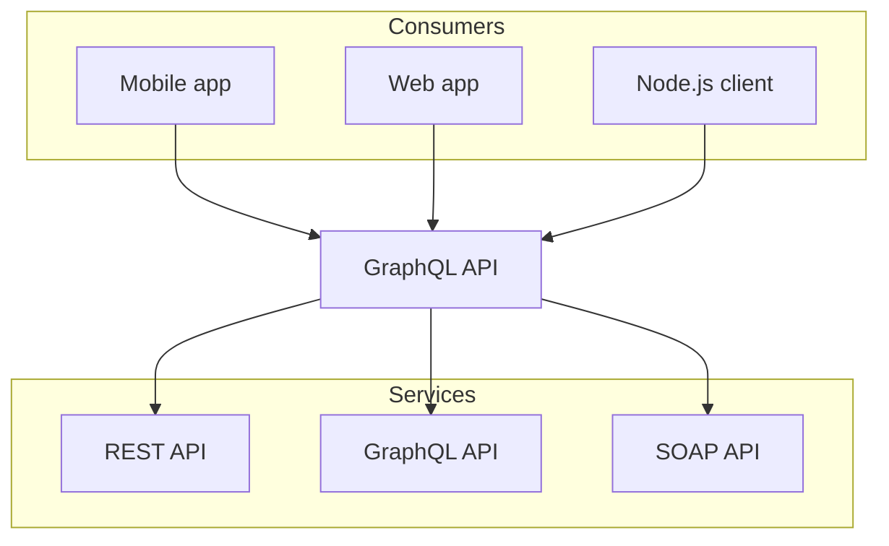

## Code Block

```js
console.log('Hello World');
```

## Mermaid

<Mermaid
  chart="
graph TD;
subgraph AA [Consumers]
A[Mobile app];
B[Web app];
C[Node.js client];
end
subgraph BB [Services]
E[REST API];
F[GraphQL API];
G[SOAP API];
end
Z[GraphQL API];
A --> Z;
B --> Z;
C --> Z;
Z --> E;
Z --> F;
Z --> G;"
/>



## Math

Inline: $$c = \pm\sqrt{a^2 + b^2}$$

```math
c = \pm\sqrt{a^2 + b^2}
```

## Two Slash

```ts twoslash
// @errors: 2339
console.g
//      ^|
```

## Cards

<Cards>
  <Card title="Learn more about Next.js" href="https://nextjs.org/docs" />
  <Card title="Learn more about Fumadocs" href="https://fumadocs.dev" />
</Cards>
